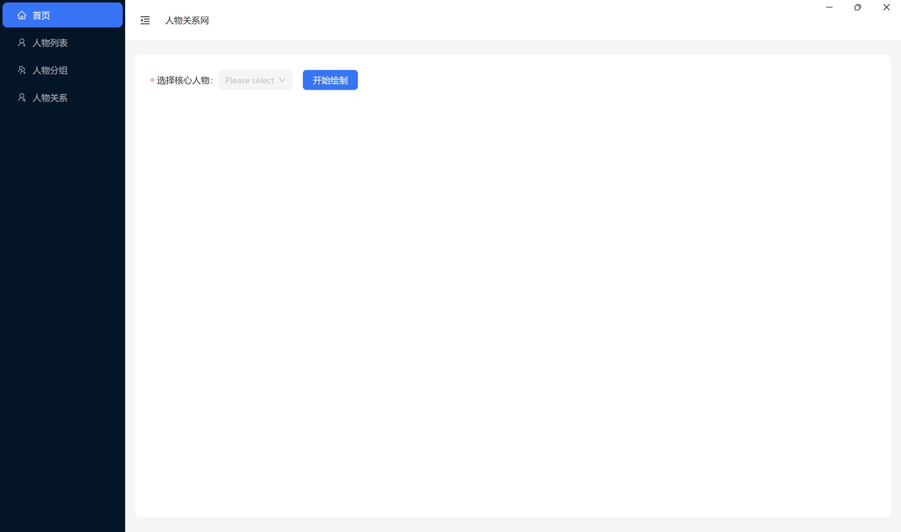
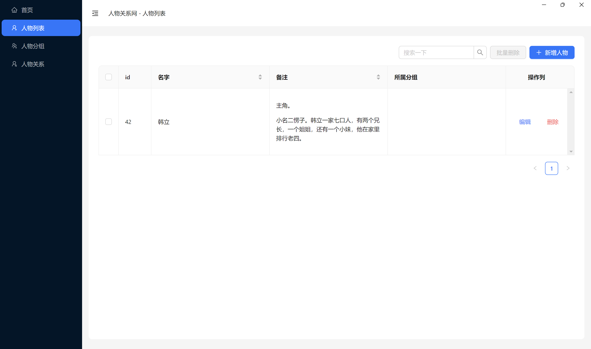
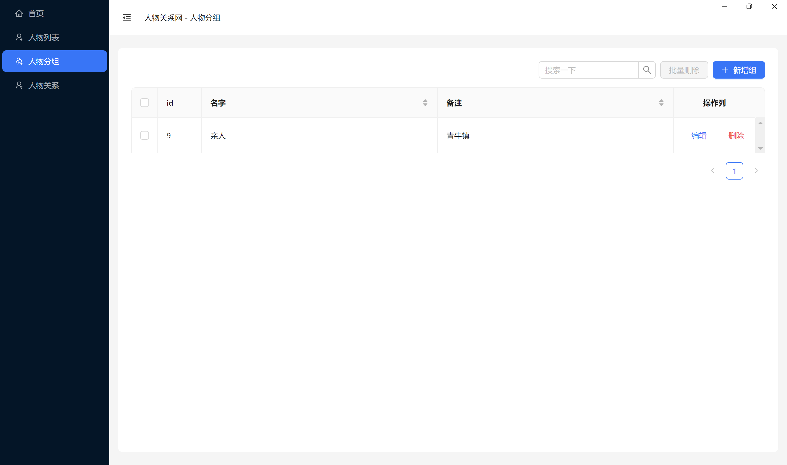
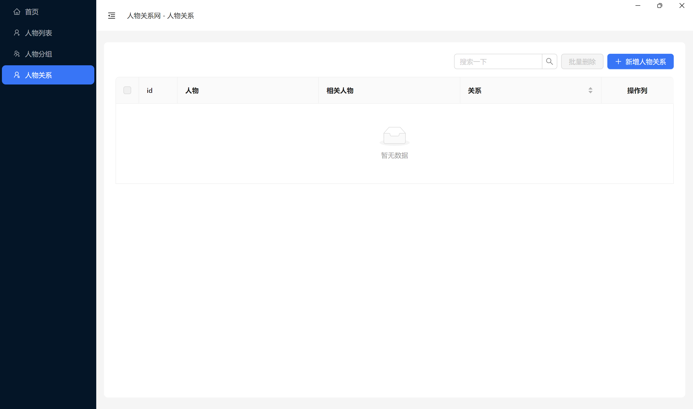

# 人物关系网

> 使用本地 sqlite 数据库，您的数据只保存在您自己的设备上，安全！

安装最新版本，目前仅提供 windows 版本：[Relationship APP](https://github.com/can-dy-jack/relationship/releases)

## Preview

首页 / 绘图页



人物列表页



人物分组页



人物关系页



## 参与开发

欢迎参与本项目的开发👏

### 安装环境

```bash
# 安装依赖
## 大陆地区可以使用 --registry=https://registry.npmmirror.com 加快速度
npm install 
```

### 配置 Prisma 环境

#### 初始化自己的 Prisma

本项目提供了一个测试用的prisma文件夹。  
如果你需要创造自己的数据库，请先删除 prisma 文件夹，然后执行：

```bash
prisma npx prisma init --datasource-provider sqlite
```

然后在 prisma 文件夹下的 `schema.prisma` 文件编写属于你自己的数据库结构。  
接着初始化 prisma ：

```bash
npm run generate
```

**注意**，需要在 `schema.prisma` 文件里注释掉 `output` 这一行之后再执行一次 `npm run generate` 以保证本地开发时有正确的类型提示！

#### 使用本项目的结构

如果你暂时不需要本项目的数据库，可以直接使用。

初始化 prisma ：

```bash
npm run generate
```

**注意**，需要在 `schema.prisma` 文件里注释掉 `output` 这一行之后再执行一次 `npm run generate` 以保证本地开发时有正确的类型提示！

### 本地开发

本地运行时直接输入：

```bash
npm run start
```

第一次运行可能会慢点

### 打包

打包运行：

```bash
npm run package
```

即可打包自己系统下的安装包。

**注意**：第一次打包可能会报错或者打包的有问题，可能是需要权限问题，需要用管理员权限打开命令行打包。

### 提交代码注意事项

1. 如果你创建了不同于本项目的 prisma 结构，请在git提交时忽略，不要覆盖我的数据库。

## TODO

- [ ] 设置主要人物字段
- [x] 优化删除功能
- [ ] 缩小打包体积
- [ ] 数据导入导出
  - [ ] 导入excel解析数据
  - [ ] 导出excel
  - [ ] 示例excel下载
- [ ] 增加复杂绘图调试功能；
  - [ ] 增加颜色、大小、形状等等的设置功能。
  - [ ] 保存设置的绘图参数。
- [ ] i18n

## 参考资料

- [electron-vite](https://electron-vite.org)
- [electron-vite-vue-prisma-i18next-example](https://github.com/leoFitz1024/electron-vite-vue-prisma-i18next-example)
- [electron-react-boilerplate](https://github.com/electron-react-boilerplate/electron-react-boilerplate)
